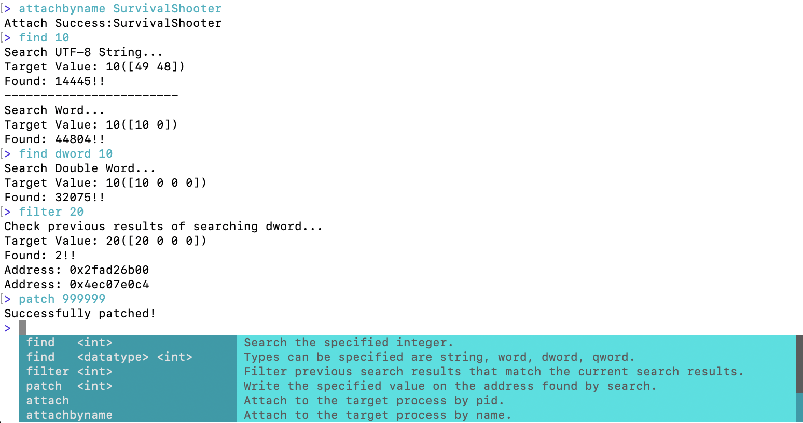

# cross-medit

Cross-platform memory analysis tool. The original is [apk-medit](https://github.com/aktsk/apk-medit).  
This tool is an extension of [apk-medit](https://github.com/aktsk/apk-medit), with some added functionalities.



# Usage

## Windows

```sh
medit.exe
```

## iOS

Jailbreaking of iphone is required.  
Place medit and Entitlements.plist in /usr/bin.

Connect to the iphone via ssh.

```sh
cd /usr/bin
ldid -SEntitlements.plist medit
./medit
```

## License

MIT License
